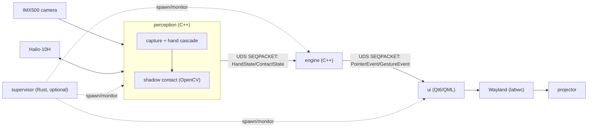
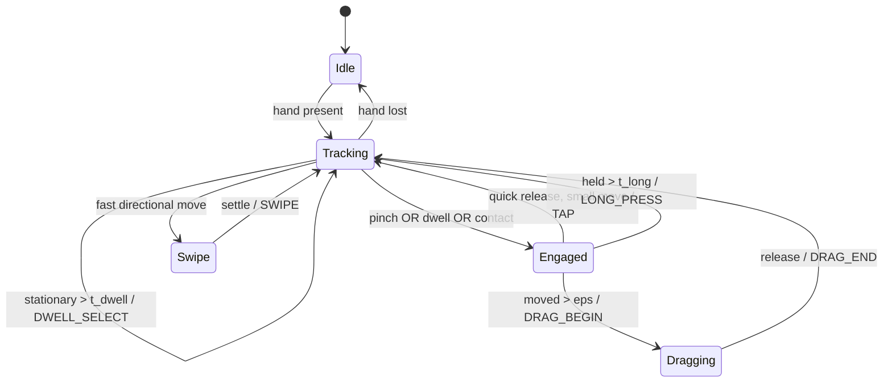

# Architecture

Consolidates Phases 1–6. Every component below exists in the repository; every
external hardware/software fact is attributed in §Sources.

## 1. Layered architecture

```
L6  UI / presentation      Qt6 Quick (Wayland client)          services/ui
L5  NUI engine             gesture FSM + contact fusion         services/engine
L4  geometry/calibration   homography camera→surface            engine + tools/calibration
L3  vision pipeline        GStreamer + TAPPAS (hailonet…)       services/perception (spec)
L2  (optional GenAI)       NOT used — no mic/speaker on target   —
L1  HAL                    libcamera/Picamera2, HailoRT, DRM/KMS —
L0  OS                     Raspberry Pi OS 64-bit + systemd      deploy/
```

Each layer depends only on the interface of the one below. The engine (L5) knows
nothing of GStreamer or Qt; it consumes a landmark stream and emits semantic
events.

## 2. Process & IPC topology

Three decoupled processes plus an optional supervisor. Rationale (ADR-0001):
video frames never cross a process boundary (they stay inside perception); only
tiny fixed-format messages transit, so multi-process costs ~nothing in latency
while buying fault isolation and testability.



**Transport**: `AF_UNIX` `SOCK_SEQPACKET` (message boundaries preserved, reliable,
ordered — no manual framing). Backpressure: continuous streams (HandState,
PointerEvent) drop-oldest (latest-wins); discrete GestureEvents are reliable.
28-byte header (magic/version/type/len/timestamp/seq) + fixed payload.

## 3. Data flow (engine internals, N1..N6)

```
HandState ─► N1 ingest ─► N2 1€ filter ─► N3 homography ─┐
ContactState ──────────────────────────► N4 contact fusion ─► N5 gesture FSM ─► N6 synthesize
                                                                                 │
                                              PointerEvent (continuous) ◄────────┤
                                              GestureEvent (discrete)   ◄────────┘
```

## 4. Gesture state machine (N5)


HOME (open palm held) and BACK (fist held) are detected from landmark geometry
in the engine core. Two-hand ZOOM is deferred (the single-hand message carries
one hand — a documented limit).

## 5. AI / perception

- **Hand landmarks on the Hailo-10H** (ADR-0002): two-stage MediaPipe-style
  cascade — `palm_detection_lite` → crop → `hand_landmark_lite`, both present in
  the Hailo Model Zoo for the HAILO10H architecture. Wired with TAPPAS
  `hailonet`/`hailofilter`/`hailocropper`/`hailoaggregator` (`services/perception/pipeline/hand_cascade.gst`).
- **Tracking gate** (`tracking_gate.hpp`, ADR-0006): palm detection runs only on
  acquisition/loss, reusing the tracked ROI otherwise — measured ~99 % fewer palm
  invocations in continuous tracking (logic-level proxy; real FPS gain is target-measured).
- **Contact = hybrid** (ADR-0003): primary is pinch/dwell (content- and
  light-independent, robust); the shadow-adjacency channel (`shadow_contact.cpp`)
  is an optional enhancement that auto-degrades to pinch/dwell on dark content or
  bright ambient light. Single 2D RGB camera cannot reliably sense true surface
  contact — this is the project's highest technical risk.

## 6. Key decisions (see docs/adr for full records)

| ADR | Decision |
|-----|----------|
| 0001 | Multi-process + UDS SEQPACKET event bus |
| 0002 | Full hand cascade on Hailo-10H; IMX500 as plain camera |
| 0003 | Hybrid contact: pinch/dwell primary, shadow optional |
| 0004 | No voice (no mic/speaker); projected keyboard for text |
| 0005 | Rust supervisor optional/collapsible; systemd primary |
| 0006 | Tracking gate to cut palm-detection load |

## Sources (external facts)

Facts below were verified via vendor/primary sources during design; re-verify on
the target as versions move.

- **Hailo-10H / AI HAT+ 2**: 40 TOPS (INT4), 8 GB dedicated LPDDR4X (invisible to
  the Pi), PCIe Gen3 x1; vision throughput comparable to the 26-TOPS Hailo-8; a
  GenAI-oriented part. Sources: Raspberry Pi documentation (raspberrypi.com), Hailo
  (hailo.ai), and Jeff Geerling's Jan 2026 hands-on (which also flagged that the
  hailo-rpi5 examples were not yet updated for the 10H at launch).
- **TAPPAS on Hailo-10H**: TAPPAS supports the Hailo-10H with HailoRT v5.3.0
  (`hailo-ai/tappas`, GitHub). No turnkey two-stage *hand* app is provided.
- **Hailo Model Zoo hand landmark**: `palm_detection_lite` + `hand_landmark_lite`
  (MediaPipe-derived) listed for HAILO10H (`hailo-ai/hailo_model_zoo`).
- **1€ filter**: Casiez, Roussel, Vogel, "1€ Filter", CHI 2012.
- **Shadow-based touch**: Wilson, "PlayAnywhere", UIST 2005; Dai & Chung, CVPRW
  2012; Song et al., JSID 2017 (predicted-image segmentation).
- **Picamera2 API**: official Picamera2 manual (datasheets.raspberrypi.com).
- **PCIe Gen3 on Pi 5**: `dtparam=pciex1_gen=3` in config.txt (Raspberry Pi docs).

Where a specific figure could not be confirmed (exact model input dims, end-to-end
latency/FPS, exact Hailo device node names), the code and docs say **"Je ne sais
pas"** and defer to on-target verification rather than guessing.
